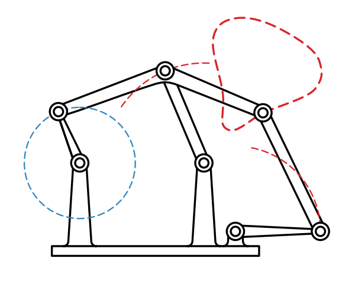
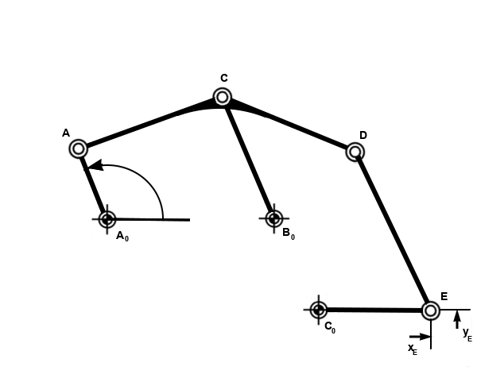
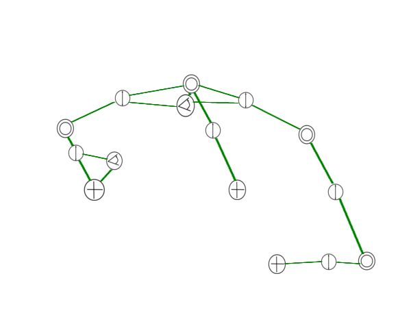
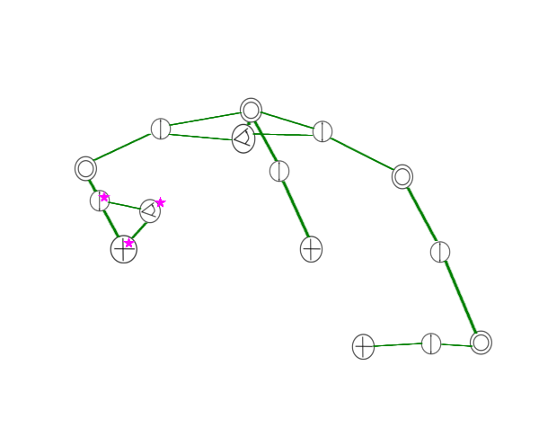
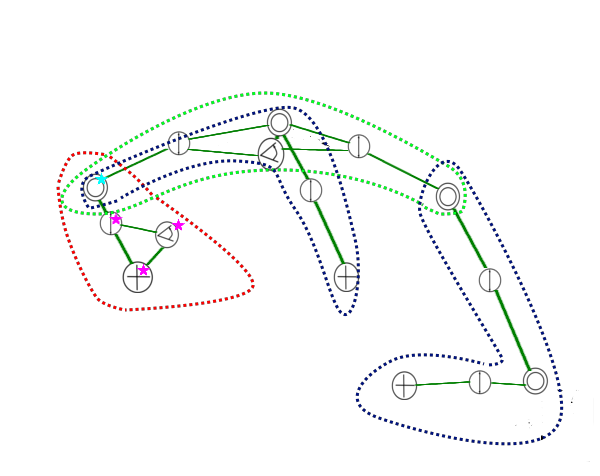
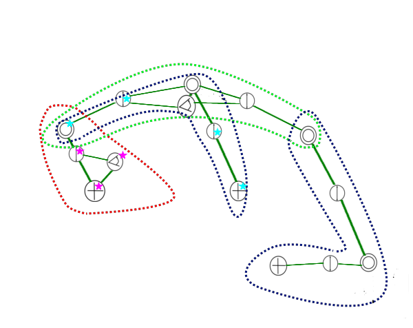

# Documentation
## Steps of a computation approach
- Question: When some parts are moving, how are others in the mechanism affected?
- 
- maybe the part in the blue dotted circle is moving, what happens hat the end of the chain on the right side?
- there are technical drawing for mechanism
- 
- these can be seen as labeled graph
- 
- there already exist some equations for computation for modules (see references)
- 
- these modules can be found in the graph
- the pink stars show the possibility for a module
- 
- maybe there are different modules which fitting for same areas so the calculations is ambiguous
- these pink star module with its calculation result can lead to starting point of the next module (cyan star)
- 
- with backtracking the problem can solved by systematic tryout.
- similar to a mace, the algorithm tries to come as far as possible
